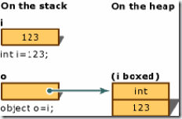

 **装箱**  值类型   --> 引用类型

 **拆箱**  引用类型 --> 值类型

.Net的类型分为两种，一种是值类型(Value Type )，另一种是引用类型(Reference Type)。值类型数据是分配在栈中，而引用类型数据分配在堆上。

例子：int i = 123; Object obj = (object)i;

实际过程：

第一步：新分配堆内存(大小为值类型实例大小加上一个方法表指针和一个SyncBlockIndex)。 

第二步：将值类型的实例字段拷贝到新分配的内存中。 

第三步：返回堆中新分配对象的地址。这个地址就是一个指向对象的引用了。

我们通过这种方式将一个值类型的i装箱为一个Object类型的 obj变量

拆箱就是一个逆过程了,将一个Object 类型的o变量还原为int型的i变量,它进行了如下操作：

 - 环境须先判断堆栈上指向合法对象的地址，以及在对此对象向指定的类型进行转换时是否合法，如果不合法，就抛出异常；

 - 当判断类型转换正确，就返回一个指向对象内的值的指针。

针对上面的合法性判断,有两点需要我们注意：

 - 包含已装箱的值类型的引用的变量如果为null，就抛出一个NullReferenceException异常。

 - 如果引用指向的对象不是所要求的值类型的一个已装箱的实例，就抛出一个InvaildCastException异常

带来的影响:

我们可以从两个方面考虑:一个就是对于堆的操作效率比较低；另一个就是对于堆上分配的内存资源，需要GC来回收，从而降低程序效率。

显然，直观的来说.装箱时，生成的是全新的引用对象，这会有时间损耗，也就是造成效率降低。 
当然我们也可以直观的看出, **拆箱所带来的性能损失是远小于装箱所带来的损失的。**

参考：

1.http://www.cnblogs.com/Creator/archive/2011/03/20/1989220.html
